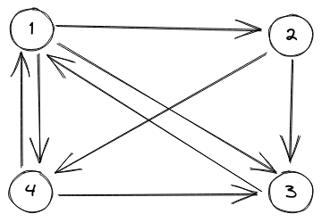

# PageRank

This project is a simple implementation of PageRank algorithm, using C.

## Usage
Clone the repo:
```Bash
git clone git@github.com:joshhauser/PageRank.git
```

Compile the program:
```Bash
make
```

Execute the program, with or without args:
- with args:
```Bash
./pagerank <graph path> <max_iterations> <damping factor>
```
> Note that most of the time, `0.85` is recommanded for damping factor.

- vithout args:
```Bash
./pagerank # default parameters are hard coded 
```

### Input
The input must be a file that represents an oriented graph as below:
```
1 2
1 3
1 4
2 3
2 4
3 1
4 1
4 3
```


Each line is a link between two vertices : the first vertice is the starting point, and the second one is the ending point.

### Output
3 output files are created by this program. Their paths are hard coded!
- `output/normalized_graph.txt`: contains the "normalized graph" data, i.e. list of orderly vertices labels
- `output/matrix.txt`: contains the transition matrix
- `output/eigen_vector.txt`: contains the eigen vector generated by PageRank algorithm

### Dataset
| Graph's name | Nodes count | Links count |
|-----------------------|------------------|-----------------|
| [email-EU-core](http://snap.stanford.edu/data/email-Eu-core.html) | 1070 | 25571 |
| [higgs-reply_network](http://snap.stanford.edu/data/higgs-reply_network.edgelist.gz) | 39192 | 32523 |
| [p2p-Gnutella04](http://snap.stanford.edu/data/p2p-Gnutella04.html) | 10876 | 39994 |
| [Wiki-Vote](http://snap.stanford.edu/data/wiki-Vote.html) | 7115 | 103689 |
| [twitch_FR](http://snap.stanford.edu/data/twitch.zip) | 6549 | 112666 |
| [higgs-mention_network](http://snap.stanford.edu/data/higgs-mention_network.edgelist.gz) | 118427 | 150818 |
| [Slashdot0811](Slashdo) | 77360 | 905468 |

## Useful links

- <a href="https://towardsdatascience.com/pagerank-algorithm-fully-explained-dc794184b4af" target="_blank">Article about PageRank, written by Amrani Amine on "towards data science"</a>
- <a href="https://en.wikipedia.org/wiki/PageRank" target="_blank">Wikipedia english page about PageRank</a>
